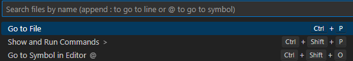
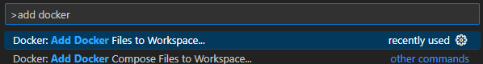
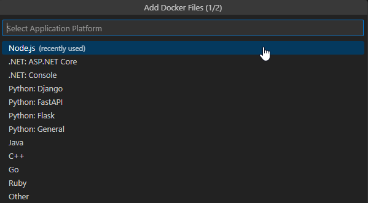
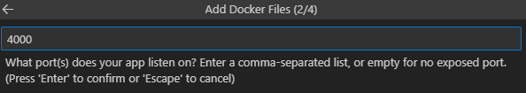
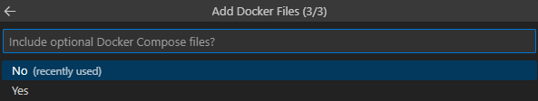
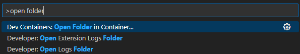
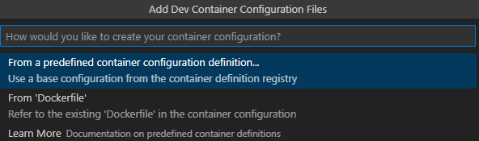
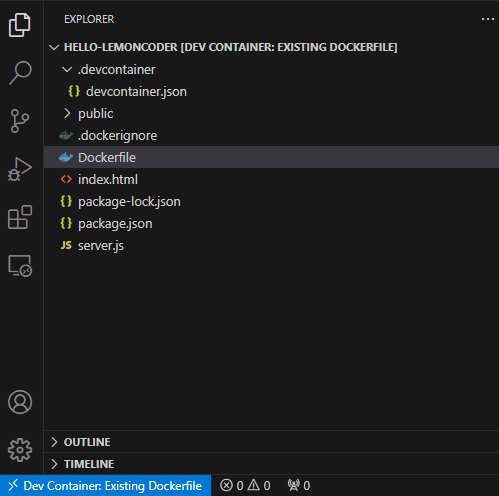
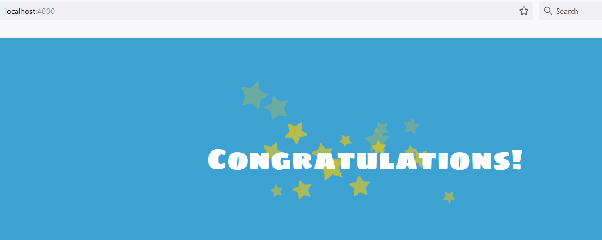

# Ejercicio 1

Para contenerizar nuestra aplicación *hello-lemoncoder* podemos crear nuestro fichero Dockerfile manualmente o utilizar las herramientas que nos provee Visual Studio Code junto con extensiones como Docker y Dev Containers.

Para ello hacemos click en el buscador.



Y le damos a Show and Run commands (o alternativamente utilizamos el atajo Ctrl + Shift + P) y buscamos la opción *Add Docker Files to Workspace*.



Seleccionamos Node.js de la lista.



Especificamos el puerto donde escuchará nuestro servidor.



Indicamos si queremos que genere los ficheros de docker compose. En este caso le daremos a no.



Finalmente vemos que ha generado automáticamente dos ficheros: *Dockerfile* y *.dockerignore*.

A partir de aquí, podemos construir nuestra imagen dentro de VS Code. Hacemos click con el botón derecho sobre Dockerfile y presionamos *Build Image*. Se abrirá una terminal y veremos algo similar a lo siguiente.

```shell
 *  Executing task: docker-build 

> docker image build --pull --file "C:\DanielProjects\bl-devops-exercises/01-contenedores/contenedores-iii/hello-lemoncoder/Dockerfile" --tag "hellolemoncoder:latest" --label "com.microsoft.created-by=visual-studio-code" "C:\DanielProjects\bl-devops-exercises/01-contenedores/contenedores-iii/hello-lemoncoder" <

#0 building with "default" instance using docker driver

#1 [internal] load .dockerignore
#1 transferring context: 375B 0.0s done
#1 DONE 0.2s

#2 [internal] load build definition from Dockerfile
#2 transferring dockerfile: 333B 0.0s done
#2 DONE 0.2s

#3 [internal] load metadata for docker.io/library/node:lts-alpine
#3 DONE 1.8s

#4 [1/6] FROM docker.io/library/node:lts-alpine@sha256:a315556d82ef54561e54fca7d8ee333382de183d4e56841dcefcd05b55310f46
#4 resolve docker.io/library/node:lts-alpine@sha256:a315556d82ef54561e54fca7d8ee333382de183d4e56841dcefcd05b55310f46 0.0s done
#4 ...

#5 [internal] load build context
#5 transferring context: 37.77kB 0.0s done
#5 DONE 0.1s

#4 [1/6] FROM docker.io/library/node:lts-alpine@sha256:a315556d82ef54561e54fca7d8ee333382de183d4e56841dcefcd05b55310f46
#4 sha256:59b53223883658bc9b0a8eeb1f2d16e327bebcdc7a668c80ce36649db485cd2b 6.78kB / 6.78kB done
#4 sha256:a315556d82ef54561e54fca7d8ee333382de183d4e56841dcefcd05b55310f46 1.43kB / 1.43kB done
#4 sha256:a0b787b0d53feacfa6d606fb555e0dbfebab30573277f1fe25148b05b66fa097 1.16kB / 1.16kB done
#4 sha256:76c34934b3319c116bffd4685ee2bcb032298ccce64b89b7081ec18ffdbd6175 0B / 2.34MB 0.1s
#4 sha256:fdef87f136ff3e0ba0d622cf3a573aebe6891d240d7dd55799ac0fd30a706db4 0B / 453B 0.1s
#4 sha256:824de1d006d492e037a03312c272427b62e171607bc6fb0e7db991b2eda190b7 0B / 47.91MB 0.1s
#4 sha256:76c34934b3319c116bffd4685ee2bcb032298ccce64b89b7081ec18ffdbd6175 1.05MB / 2.34MB 0.4s
#4 sha256:76c34934b3319c116bffd4685ee2bcb032298ccce64b89b7081ec18ffdbd6175 2.34MB / 2.34MB 0.5s done
#4 sha256:fdef87f136ff3e0ba0d622cf3a573aebe6891d240d7dd55799ac0fd30a706db4 453B / 453B 0.6s done
#4 sha256:824de1d006d492e037a03312c272427b62e171607bc6fb0e7db991b2eda190b7 4.19MB / 47.91MB 1.0s
#4 sha256:824de1d006d492e037a03312c272427b62e171607bc6fb0e7db991b2eda190b7 7.34MB / 47.91MB 1.4s
#4 sha256:824de1d006d492e037a03312c272427b62e171607bc6fb0e7db991b2eda190b7 10.49MB / 47.91MB 1.8s
#4 sha256:824de1d006d492e037a03312c272427b62e171607bc6fb0e7db991b2eda190b7 13.63MB / 47.91MB 2.1s
#4 sha256:824de1d006d492e037a03312c272427b62e171607bc6fb0e7db991b2eda190b7 16.78MB / 47.91MB 2.4s
#4 sha256:824de1d006d492e037a03312c272427b62e171607bc6fb0e7db991b2eda190b7 19.92MB / 47.91MB 2.8s
#4 sha256:824de1d006d492e037a03312c272427b62e171607bc6fb0e7db991b2eda190b7 24.12MB / 47.91MB 3.2s
#4 sha256:824de1d006d492e037a03312c272427b62e171607bc6fb0e7db991b2eda190b7 27.26MB / 47.91MB 3.5s
#4 sha256:824de1d006d492e037a03312c272427b62e171607bc6fb0e7db991b2eda190b7 30.41MB / 47.91MB 3.7s
#4 sha256:824de1d006d492e037a03312c272427b62e171607bc6fb0e7db991b2eda190b7 34.60MB / 47.91MB 4.0s
#4 sha256:824de1d006d492e037a03312c272427b62e171607bc6fb0e7db991b2eda190b7 39.85MB / 47.91MB 4.4s
#4 sha256:824de1d006d492e037a03312c272427b62e171607bc6fb0e7db991b2eda190b7 42.99MB / 47.91MB 4.9s
#4 sha256:824de1d006d492e037a03312c272427b62e171607bc6fb0e7db991b2eda190b7 46.14MB / 47.91MB 5.1s
#4 sha256:824de1d006d492e037a03312c272427b62e171607bc6fb0e7db991b2eda190b7 47.91MB / 47.91MB 5.4s done
#4 extracting sha256:824de1d006d492e037a03312c272427b62e171607bc6fb0e7db991b2eda190b7
#4 extracting sha256:824de1d006d492e037a03312c272427b62e171607bc6fb0e7db991b2eda190b7 5.1s
#4 extracting sha256:824de1d006d492e037a03312c272427b62e171607bc6fb0e7db991b2eda190b7 7.9s done
#4 extracting sha256:76c34934b3319c116bffd4685ee2bcb032298ccce64b89b7081ec18ffdbd6175
#4 extracting sha256:76c34934b3319c116bffd4685ee2bcb032298ccce64b89b7081ec18ffdbd6175 0.2s done
#4 extracting sha256:fdef87f136ff3e0ba0d622cf3a573aebe6891d240d7dd55799ac0fd30a706db4
#4 extracting sha256:fdef87f136ff3e0ba0d622cf3a573aebe6891d240d7dd55799ac0fd30a706db4 done
#4 DONE 14.7s

#6 [2/6] WORKDIR /usr/src/app
#6 DONE 0.9s

#7 [3/6] COPY [package.json, package-lock.json*, npm-shrinkwrap.json*, ./]
#7 DONE 0.2s

#8 [4/6] RUN npm install --production --silent && mv node_modules ../
#8 5.493 npm notice 
#8 5.496 npm notice New major version of npm available! 9.8.1 -> 10.2.0
#8 5.496 npm notice Changelog: <https://github.com/npm/cli/releases/tag/v10.2.0>
#8 5.496 npm notice Run `npm install -g npm@10.2.0` to update!
#8 5.496 npm notice 
#8 DONE 6.0s

#9 [5/6] COPY . .
#9 DONE 0.2s

#10 [6/6] RUN chown -R node /usr/src/app
#10 DONE 0.7s

#11 exporting to image
#11 exporting layers
#11 exporting layers 0.4s done
#11 writing image sha256:6fa40c58dd4736ee4c1d521160285f70a19d9288b672b60d4b8406330dbd8a98 done
#11 naming to docker.io/library/hellolemoncoder:latest 0.0s done
#11 DONE 0.4s
 *  Terminal will be reused by tasks, press any key to close it. 

```

Comprobamos que la imagen está disponible en nuestro repositorio local.
```shell
$ docker images *lemoncoder*
REPOSITORY        TAG       IMAGE ID       CREATED         SIZE
hellolemoncoder   latest    6fa40c58dd47   2 minutes ago   182MB
```

Ahora vamos a levantar un contenedor con esta imagen desde VS Code. Para ello en el buscador escribimos *Open Folder in Container* y seleccionamos la carpeta *hello-lemoncoder*.




Nos preguntará cómo queremos construir nuestro contenedor y seleccionamos desde fichero Dockerfile.



Finalmente nos preguntará si queremos añadir algún componente más al contenedor. En este caso seleccionamos directamente *OK*. Tras esto se nos abrirá el proyecto en modo contenedor.



Si comprobamos los contenedores que tenemos activos en este momento, vemos que ha sido levantado uno por VS Code.

```shell
$ docker ps
CONTAINER ID   IMAGE                                                                                   COMMAND                  CREATED          STATUS          PORTS      NAMES
a78d3e050c28   vsc-hello-lemoncoder-ca720df1d19cffa121e9508f1b6d3d8716bb072339cfb85c184ec5fb5ad492f4   "/bin/sh -c 'echo Co…"   10 minutes ago   Up 10 minutes   4000/tcp   lucid_robinson
```

Pero ojo al detalle del puerto. ¡No tiene el Port Forwarding activado! Por lo tanto, no va a ser accesible desde el host.

Para habilitar el acceso, nos vamos a la carpeta *.devcontainer* y editamos el fichero *devcontainer.json*.

Tenemos dos opciones disponibles según la documentación de VS Code ([Forwarding or publishing a port](https://code.visualstudio.com/docs/devcontainers/containers#_forwarding-or-publishing-a-port)):
* Añadir Port Forwarding que enrutará el puerto 4000 del host al 4000 del contenedor.
    ```
    "forwardPorts": [4000]
    ```
* Publicar el puerto a través de Docker.
    ```
    "appPort": [ "4000:4000" ]
    ```

Adicionalmente hay que añadir la siguiente línea al fichero de configuración como indica en este Github Issue: [appPort doesn't seem to allow connecting to port from browser](https://github.com/microsoft/vscode-remote-release/issues/319)
```
"overrideCommand": false
```

Una vez realizado esto, hacemos rebuild del contenedor (dependiendo de la opción que hayamos escogido) y ya tenemos nuestro contenedor totalmente accesible desde el host.

Si vamos a la URL [http://localhost:4000](http://localhost:4000) nos devolverá la web desplegada.

