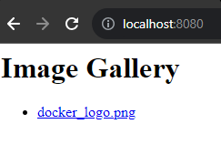

# Ejercicio 1

En primer lugar, vamos a crear la imagen galleryapp.

```
docker build -t galleryapp:0.0.1 gallery-app/
```


Una vez creada la imagen, tendremos que levantar un contenedor que utilice esta imagen y esté montado en la carpeta images del WORKDIR.

Como tenemos acceso al Dockerfile, ya sabemos que el working directory es */usr/src/app* y el puerto utilizado es *8080*, pero si no lo tuvieramos, podríamos inspeccionar la imagen y sacarlo de esta con el siguiente comando.

```shell
$ docker image inspect galleryapp:0.0.1 | jq ".[].Config.WorkingDir"
"/usr/src/app"

$ docker image inspect galleryapp:0.0.1 | jq ".[].Config.ExposedPorts"
{
  "8080/tcp": {}
}
```

Levantamos el contenedor dejando a Docker que gestione el volumen.

```
docker run -d --name galleryapp \
            -p 8080:8080 \
            -v images:/usr/src/app/images \
            galleryapp:0.0.1
```

Comprobamos que esté activo.

```shell
$ docker ps
CONTAINER ID   IMAGE              COMMAND                  CREATED         STATUS         PORTS                    NAMES
0b2e3f21e50a   galleryapp:0.0.1   "docker-entrypoint.s…"   9 seconds ago   Up 9 seconds   0.0.0.0:8080->8080/tcp   galleryapp
```

Accedemos a la URL *http://localhost:8080* y observamos que la app está funcionando correctamente.


Añadimos una imagen al volumen y vemos el resultado.

```shell
$ docker cp images/docker_logo.png galleryapp:/usr/src/app/images
Successfully copied 4.1kB to galleryapp:/usr/src/app/images
```

Refrescamos la web y vemos que ya aparece listado.



# Ejercicio 2

Borramos el contenedor que tenemos en ejecución y comprobamos que el volumen siga existiendo.

```shell
$ docker rm -f galleryapp
galleryapp

$ docker volume ls | grep images
local     images
```

Comprobamos que el contenido del volumen sigue estando disponible.

```shell
$ docker run --rm -i \
>              -v images:/tmp/images \
>              busybox \
>              ls /tmp/images
docker_logo.png
```

El fichero docker_logo que hemos subido en el anterior ejercicio sigue persistiendo en el volumen!

# Ejercicio 3

Reutilizando la imagen del ejercicio 1, vamos a montar el volumen a una carpeta física del host.

```
docker run -d --name galleryapp \
 -p 8080:8080 \
 -v $(pwd)/images:/usr/src/app/images \
  galleryapp:0.0.1
```

Si accedemos a la URL *http://localhost:8080* observamos que los dos ficheros *PNG* que hay en la carpeta se muestran satisfactoriamente.


Si añadimos un fichero de nuevo a esta carpeta del host y refrescamos la URL, vemos que vuelve a aparecer en esta automáticamente, sin tener que hacer un copiado al contenedor.

