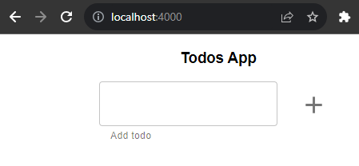
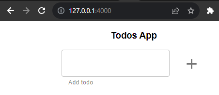
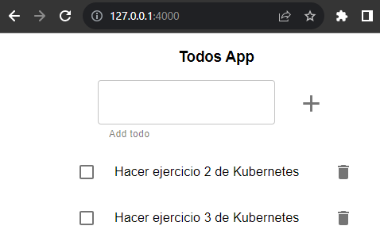

# Monolito en memoria

El equipo de desarrollo de *Lemoncode* nos ha entregado el código fuente de una aplicación monolítica, junto con su fichero *Dockerfile*, para desplegarla en Kubernetes. Para ello vamos a utilizar *minikube*  y algunos comandos de *Docker* para construir la imagen.


## Inicialización del cluster y creación de la imagen

Lo primero que vamos a realizar es levantar el cluster de minikube.

```
minikube start
```

A continuación, vamos a apuntar la terminal para usar el daemon de Docker dentro de minikube y así reusar las imágenes creadas localmente. Para más información, visitar el siguiente enlace: [Pushing directly to the in-cluster Docker daemon (docker-env)](https://minikube.sigs.k8s.io/docs/handbook/pushing/#1-pushing-directly-to-the-in-cluster-docker-daemon-docker-env)

```
eval $(minikube docker-env)
```

Ahora, ya podemos construir la imagen con el siguiente comando.

```
docker build -f todo-app/Dockerfile -t todoapp-monolith-memory:0.0.1 todo-app/
```

Una vez finalizada la construcción de la imagen, la tendremos en nuestro repositorio local.

```shell
$ docker image ls | grep todoapp
todoapp-monolith-memory                   0.0.1     5bf5264e5229   25 seconds ago   93.2MB
```

# Creación del deployment

Creamos un fichero YAML en nuestro proyecto con el nombre que queramos, en este caso *deployment.yaml* y añadimos la siguiente configuración.

```yaml
apiVersion: apps/v1
kind: Deployment
metadata:
  name: todoapp-memory
spec:
  selector:
    matchLabels:
      app: todoapp-memory
  replicas: 1
  template:
    metadata:
      labels:
        app: todoapp-memory
    spec:
      containers:
      - name: todoapp-memory
        image: todoapp-monolith-memory:0.0.1
        resources:
          requests:
            memory: "128Mi"
            cpu: "15m"
          limits:
            memory: "256Mi"
            cpu: "30m"
        ports:
        - containerPort: 4000
          name: app
        env:
        - name: NODE_ENV
          value: production
        - name: PORT
          value: "4000"
```

Ejecutamos el siguiente comando para desplegar la configuración sobre el cluster.

```shell
$ kubectl apply -f deployment.yaml 
deployment.apps/todoapp-memory created
```

A través del comando *GET* de kubectl podemos comprobar los estados de cada pieza que ha desplegado.

```shell
$ kubectl get deployment
NAME             READY   UP-TO-DATE   AVAILABLE   AGE
todoapp-memory   1/1     1            1           56s

$ kubectl get pods
NAME                              READY   STATUS    RESTARTS   AGE
todoapp-memory-599fdff479-xmh4x   1/1     Running   0          117s
```

Podemos comprobar que coincide con lo que le hemos indicado en la configuración y el pod está en estado *Running*, por lo que ya listo para aceptar peticiones.

Para comprobar de manera rápida y temporal que la aplicación está ejecutando correctamente, vamos a realizar una redirección del pod a un puerto local con el comando port-forward de kubectl. Este comando le tenemos que indicar el puerto que vamos a mapear, en este caso el 4000, por lo que redigirá el puerto 4000 del contenedor al puerto 4000 de la máquina local. Por último indicar que este comando es un proceso bloqueante, por lo que cuando terminemos nuestras pruebas, debemos terminar la ejecución del comando, por ejemplo con *CTRL + C*.

```shell
$ kubectl port-forward deployment/todoapp-memory 4000
Forwarding from 127.0.0.1:4000 -> 4000
Forwarding from [::1]:4000 -> 4000
```

Si vamos a nuestro navegador y abrimos la URL [http://localhost:4000/](http://localhost:4000/), vemos que la aplicación está corriendo correctamente.



Ahora ya podemos terminar la ejecución del comando port-forward.

¿Y si no tenemos acceso a la máquina local? Podemos levantar un pod con la imagen de busybox para hacer una petición a la app.

Pero antes necesitaremos la IP del pod. Para ello le pasamos la opción *-o wide* al comando get.

```shell
$ k get pods -o wide
NAME                              READY   STATUS    RESTARTS   AGE   IP            NODE       NOMINATED NODE   READINESS GATES
todoapp-memory-599fdff479-xmh4x   1/1     Running   0          38m   10.244.0.19   minikube   <none>           <none>
```

Ahora, ejecutamos el comando *RUN* de kubectl y luego desde dentro del terminal, hacemos usamos *wget* para hacer una petición a la IP del pod.

```shell
$ kubectl run bb --image busybox -it --restart=Never --rm
If you don't see a command prompt, try pressing enter.
/ #
/ #
/ # wget -O- -S http://10.244.0.19:4000
Connecting to 10.244.0.19:4000 (10.244.0.19:4000)
  HTTP/1.1 200 OK
  X-Powered-By: Express
  Accept-Ranges: bytes
  Cache-Control: public, max-age=0
  Last-Modified: Sun, 19 Nov 2023 19:32:22 GMT
  ETag: W/"179-18be911d8ae"
  Content-Type: text/html; charset=UTF-8
  Content-Length: 377
  Date: Mon, 20 Nov 2023 11:27:11 GMT
  Connection: close

writing to stdout
<!doctype html><html lang="en"><head><meta charset="UTF-8"><meta name="viewport" content="width=device-width,initial-scale=1"><title>Document</title><script defer="defer" src="app.b8b0e4cb79b042e3b85d.js"></script><script defer="defer" src="appStyles.beb67821f56c11f5d9a2.js"></script><link href="appStyles.css" rel="stylesheet"></head><body><div id="roo-                    100% |*********************************************************************************************************************************|   377  0:00:00 ETA 
written to stdout
/ # exit
pod "bb" deleted
```

Se puede comprobar como hay conectividad desde dentro del cluster.

## Creación del LoadBalancer

En primer lugar, crearemos el fichero YAML de configuración del servicio tipo *Load Balancer*.

```yaml
apiVersion: v1
kind: Service
metadata:
  name: loadbalancer
spec:
  type: LoadBalancer
  selector:
    app: todoapp-memory
  ports:
  - port: 4000
    targetPort: 4000
```

Aplicamos la configuración en el cluster y revisamos los objetos que ha desplegado.

```shell
$ kubectl apply -f loadbalancer.yaml 
service/loadbalancer configured

$ kubectl get svc
NAME           TYPE           CLUSTER-IP     EXTERNAL-IP   PORT(S)          AGE
kubernetes     ClusterIP      10.96.0.1      <none>        443/TCP          27d
loadbalancer   LoadBalancer   10.99.79.255   <pending>     4000:30850/TCP   5s

$ kubectl get endpoints
NAME           ENDPOINTS           AGE
kubernetes     192.168.49.2:8443   27d
loadbalancer   10.244.0.19:4000    11s
```

Kubernetes ha creado el servicio de tipo LoadBalancer y ha incluido en este un nuevo endpoint, correspondiente con el pod con el que hemos estado jugando anteriormente.

Sin embargo, vemos que la IP externa del Load Balancer está en estado Pending. Para que minikube le asigne una IP al servicio, hay que usar el comando [minikube tunnel](https://minikube.sigs.k8s.io/docs/handbook/accessing/#using-minikube-tunnel).

Cuando ejecutamos el comando en una nueva terminal, vemos que minikube ha creado un tunel para nuestro servicio *loadbalancer*.

```shell
$ minikube tunnel
✅  Tunnel successfully started

📌  NOTE: Please do not close this terminal as this process must stay alive for the tunnel to be accessible ...

🏃  Starting tunnel for service loadbalancer.
```

Si volvemos a ver el listado de los servicios, observamos que ya tenemos una IP externa asignada.

```shell
$ kubectl get svc
NAME           TYPE           CLUSTER-IP     EXTERNAL-IP   PORT(S)          AGE
kubernetes     ClusterIP      10.96.0.1      <none>        443/TCP          27d
loadbalancer   LoadBalancer   10.99.79.255   127.0.0.1     4000:30850/TCP   7m11s
```

Por lo tanto, ahora nuestra aplicación está disponible desde fuera del cluster a través de la URL [http://127.0.0.1:4000/](http://127.0.0.1:4000/).



## Uso de la aplicación

Vamos a añadir algunas tareas para hacer en la aplicación.



Si ahora escalamos el deployment a 0 y luego lo volvemos a escalar a 1, observaremos que los datos introducidos se han perdido pues la persistencia se realiza en memoria.

```shell
$ kubectl scale deployment/todoapp-memory --replicas=0
deployment.apps/todoapp-memory scaled

$ kubectl scale deployment/todoapp-memory --replicas=1
deployment.apps/todoapp-memory scaled
```

Algo similar ocurrirá, si escalamos hacia arriba y tenemos más de un pod. Cuando guardemos las tareas y refresquemos la web, dependiendo de qué pod conteste, veremos una información u otra.

## Limpieza del cluster

Para limpiar todos los objetos creados en este ejercicio, simplemente hay que utilizar el comando *DELETE*.

```shell
$ kubectl delete -f .
deployment.apps "todoapp-memory" deleted
service "loadbalancer" deleted
```

A continuación, bajamos el cluster de minikube

```shell
minikube stop
```