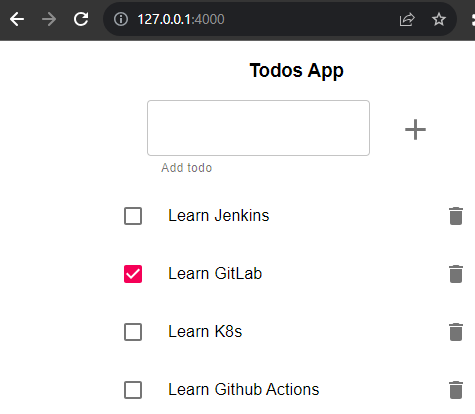

# Monolito

El equipo de desarrollo de *Lemoncode* nos ha entregado un nuevo código fuente de su aplicación junto con una serie de requisitos para solventar los problemas del monolito en memoria a través del uso de una base de datos. Para este ejercicio, vamos a utilizar de nuevo *minikube*  y algunos comandos de *Docker* para construir la imagen.

## Inicialización del cluster y creación de la imagen

Lo primero que vamos a realizar es levantar el cluster de minikube.

```
minikube start
```

A continuación, vamos a apuntar la terminal para usar el daemon de Docker dentro de minikube y así reusar las imágenes creadas localmente. Para más información, visitar el siguiente enlace: [Pushing directly to the in-cluster Docker daemon (docker-env)](https://minikube.sigs.k8s.io/docs/handbook/pushing/#1-pushing-directly-to-the-in-cluster-docker-daemon-docker-env)

```
eval $(minikube docker-env)
```

## Creación de capa de persistencia de datos

Para generar la capa de persistencia de datos, vamos a necesitar los siguientes objetos de Kubernetes:
 - Config Map
 - Storage Class
 - Persistent Volume
 - Persistent Volume Class
 - Cluster IP Service
 - StatefulSet

 Adicionalmente necesitaremos una imagen de una base de datos, en este caso PostgreSQL versión 10.4. Para la inicialización de la base de datos, según indica en la página de [postgres de Docker Hub](https://hub.docker.com/_/postgres/), todos los scripts que estén en la carpeta */docker-entrypoint-initdb.d* del contenedor serán ejecutados antes de que se arranque el servicio.

Por lo tanto, vamos a crear la imagen de la base de datos a partir del fichero *Dockerfile.todos_db*, que copiará a la imagen base de postgres, el fichero todos_db.sql que contiene la configuración necesaria.

```
docker build -f todo-app/Dockerfile.todos_db -t todoapp-postgres:0.0.1 todo-app/
```

 Una vez creada la imagen, comenzamos con la generación de los objetos en Kubernetes.
 
 ### Config Map
Contiene la configuración para la base de datos en el fichero *db-configmap.yaml*.

 ```yaml
apiVersion: v1
kind: ConfigMap
metadata:
  name: todoapp-db
data:
  POSTGRES_PASSWORD: postgres_password
 ```

 ### Storage Class
Contiene la definición de clases, ubicada en el fichero *db-storageclass.yaml*.

```yaml
apiVersion: storage.k8s.io/v1
kind: StorageClass
metadata:
  name: mysc
provisioner: k8s.io/minikube-hostpath
```

### Persistent Volume
Contiene la configuración, en el fichero *db-persistentvolume.yaml*, de la capa de almacenamiento. 

```yaml
apiVersion: v1
kind: PersistentVolume
metadata:
  name: mypv
spec:
  capacity:
    storage: 100Mi
  accessModes:
    - ReadWriteOnce
  storageClassName: mysc
  volumeMode: Filesystem
  hostPath:
    path: /data/mypv
```

### Persistent Volume Claim
Contiene la configuración de la petición, disponible en *db-persistentvolumeclaim.yaml*, que los pods realizan para obtener almacenamiento.

```yaml
apiVersion: v1
kind: PersistentVolumeClaim
metadata:
  name: mypvc
spec:
  storageClassName: mysc
  resources:
    requests:
      storage: 50Mi
  volumeMode: Filesystem
  accessModes:
    - ReadWriteOnce
```

### Cluster IP Service
Contiene la configuración del servicio, en el fichero *db-service.yaml*, que permite que los pods dentro del cluster puedan comunicarse con la base de datos.

```yaml
apiVersion: v1
kind: Service
metadata:
  name: postgres
spec:
  selector:
    app: postgres
  ports:
  - port: 5432
    targetPort: 5432
```

### StatefulSet
Contiene la configuración de los pods con estado en el fichero *db-statefulset.yaml*.

```yaml
apiVersion: apps/v1
kind: StatefulSet
metadata:
  name: postgres
spec:
  selector:
    matchLabels:
      app: postgres
  serviceName: postgres
  replicas: 1
  template:
    metadata:
      labels:
        app: postgres
    spec:
      containers:
      - name: postgres
        image: todoapp-postgres:0.0.1
        ports:
        - containerPort: 5432
          name: postgres
        volumeMounts:
        - name: data
          mountPath: /var/lib/postgresql/data
        envFrom:
        - configMapRef:
            name: todoapp-db
      volumes:
      - name: data
        persistentVolumeClaim:
          claimName: mypvc
```

## Despliegue y verificación de capa de almacenamiento
Para desplegar los objetos utilizamos el comando apply de kubectl.

```shell
$ kubectl apply -f db/.
configmap/todoapp-db created
persistentvolume/mypv created
persistentvolumeclaim/mypvc created
service/postgres created
statefulset.apps/postgres created
storageclass.storage.k8s.io/mysc created
```

Con el comando GET de kubectl podemos ver los objetos desplegados en Kubernetes, utilizando el nombre del objeto o el alias, como *sts* para *statefulsets* o *svc* para *services*. Para conocerlos podemos utilizar el recurso api-resources.

```shell
$ kubectl api-resources --sort-by=name | grep 'storageclass\|persistentvolume\|configmap\|statefulsets\|services'
apiservices                                    apiregistration.k8s.io/v1              false        APIService
configmaps                        cm           v1                                     true         ConfigMap
persistentvolumeclaims            pvc          v1                                     true         PersistentVolumeClaim
persistentvolumes                 pv           v1                                     false        PersistentVolume
services                          svc          v1                                     true         Service
statefulsets                      sts          apps/v1                                true         StatefulSet
storageclasses                    sc           storage.k8s.io/v1                      false        StorageClass
```

Comprobemos cada componente desplegado.

```shell
$ kubectl get cm
NAME               DATA   AGE
kube-root-ca.crt   1      42d
todoapp-db         1      119s

$ kubectl get sc
NAME                 PROVISIONER                RECLAIMPOLICY   VOLUMEBINDINGMODE   ALLOWVOLUMEEXPANSION   AGE
mysc                 k8s.io/minikube-hostpath   Delete          Immediate           false                  2m35s
standard (default)   k8s.io/minikube-hostpath   Delete          Immediate           false                  42d

$ kubectl get pv
NAME   CAPACITY   ACCESS MODES   RECLAIM POLICY   STATUS   CLAIM           STORAGECLASS   REASON   AGE
mypv   100Mi      RWO            Retain           Bound    default/mypvc   mysc                    5m28s

$ kubectl get pvc
NAME    STATUS   VOLUME   CAPACITY   ACCESS MODES   STORAGECLASS   AGE
mypvc   Bound    mypv     100Mi      RWO            mysc           5m48s

$ kubectl get sts
NAME       READY   AGE
postgres   1/1     7m51s

$ kubectl get svc
NAME         TYPE        CLUSTER-IP      EXTERNAL-IP   PORT(S)    AGE
kubernetes   ClusterIP   10.96.0.1       <none>        443/TCP    42d
postgres     ClusterIP   10.104.248.62   <none>        5432/TCP   8m8s
```

Todos los objetos se han creado correctamente, donde se puede observar que la persistencia de datos está utilizando la clase *mysc* en vez de la default.

 ## Creación de capa de aplicación

Creamos la imagen de Docker para la aplicación.

 ```
docker build -f todo-app/Dockerfile -t todoapp-monolith:0.0.1 todo-app/
```

A continuación, creamos los objetos de Kubernetes, que en este caso serán tres:
  - Config Map
  - Deployment
  - Load Balancer

### Config Map

Contiene la configuración de la aplicación en el fichero *app-configmap.yaml*.

```yaml
apiVersion: v1
kind: ConfigMap
metadata:
  name: todoapp-config
data:
  POSTGRES_PASSWORD: postgres
  NODE_ENV : pre
  PORT : "4000"
  DB_HOST : postgres
  DB_USER: postgres
  DB_PASSWORD: postgres_password
  DB_PORT : "5432"
  DB_NAME : todos_db
  DB_VERSION : "10.4"
```

### Deployment

Contiene la configuración del deployment que gestiona los pods de la aplicación en el fichero *app-deployment.yaml*.

```yaml
apiVersion: apps/v1
kind: Deployment
metadata:
  name: todoapp
spec:
  selector:
    matchLabels:
      app: todoapp
  template:
    metadata:
      labels:
        app: todoapp
    spec:
      containers:
      - name: todoapp
        image: todoapp-monolith:0.0.1
        resources:
          limits:
            memory: "128Mi"
            cpu: "500m"
        ports:
        - containerPort: 4000
        envFrom:
        - configMapRef:
            name: todoapp-config
```

### Load Balancer

Contiene la configuración del servicio para acceder a la aplicación desde fuera del cluster en el fichero *app-loadbalancer.yaml*.

```yaml
apiVersion: v1
kind: Service
metadata:
  name: loadbalancer-todoapp
spec:
  type: LoadBalancer
  selector:
    app: todoapp
  ports:
  - port: 4000
    targetPort: 4000
```

## Despliegue y verificación de capa de aplicación

Desplegamos y comprobamos los diferentes objetos.

```shell
$ kubectl apply -f app/.
configmap/todoapp-config created
deployment.apps/todoapp created
service/loadbalancer-todoapp created

$ kubectl get cm
NAME               DATA   AGE
kube-root-ca.crt   1      42d
todoapp-config     9      17s
todoapp-db         1      27m

$ kubectl get svc
NAME                   TYPE           CLUSTER-IP      EXTERNAL-IP   PORT(S)          AGE
kubernetes             ClusterIP      10.96.0.1       <none>        443/TCP          42d
loadbalancer-todoapp   LoadBalancer   10.110.179.94   <pending>     4000:30554/TCP   13m
postgres               ClusterIP      10.104.248.62   <none>        5432/TCP         40m

$ kubectl get deploy
NAME      READY   UP-TO-DATE   AVAILABLE   AGE
todoapp   1/1     1            1           13m
```

Se observa que todos los objetos se han desplegado correctamente, pero no se le ha asignado IP externa al servicio de LoadBalancer. Para ello, como hicimos en el anterior ejercicio, ejecutamos en una nueva terminal el comando tunnel de minikube.

```shell
$ minikube tunnel
✅  Tunnel successfully started
s
📌  NOTE: Please do not close this terminal as this process must stay alive for the tunnel to be accessible ...

🏃  Starting tunnel for service loadbalancer-todoapp.
```

Y ahora si tenemos la IP asignada, por lo que ya es accesible desde fuera del cluster.

```shell
$ kubectl get svc | grep loadbalancer
loadbalancer-todoapp   LoadBalancer   10.110.179.94   127.0.0.1     4000:30554/TCP   16m
```

## Comprobación de la aplicación completa

Podemos acceder a la aplicación a través del servicio de LoadBalancer utilizando la URL [http://127.0.0.1:4000/](http://127.0.0.1:4000/).


Añadimos una nueva entrada *Learn Github Actions* y escalamos a 0 tanto la aplicación como la base de datos.

```
$ kubectl scale deploy/todoapp --replicas=0
deployment.apps/todoapp scaled

$ kubectl scale sts/postgres --replicas=0
statefulset.apps/postgres scaled
```

Cuando los pods estén terminados, volvemos a levantarlos y comprobamos si los datos permanecen ante reinicios de los pods.



Efectivamente la información persiste correctamente, por lo que tenemos nuestra aplicación funcionando correctamente.

Pero, ¿qué ocurre si borramos todos los componentes del cluster? Vamos a verlo en detalle.

```shell
$ kubectl delete -f app/.
configmap "todoapp-config" deleted
deployment.apps "todoapp" deleted
service "loadbalancer-todoapp" deleted

$ kubectl delete -f db/.
configmap "todoapp-db" deleted
persistentvolume "mypv" deleted
persistentvolumeclaim "mypvc" deleted
service "postgres" deleted
statefulset.apps "postgres" deleted
storageclass.storage.k8s.io "mysc" deleted
```

Se han borrado todos los objetos incluidos aquellos relacionados con la persistencia.

```shell
$ kubectl get pvc
No resources found in default namespace.

$ kubectl get pv
No resources found
```

Si volvemos a levantar de nuevo todo el proyecto, vemos que la entrada de *Learn Github Actions* sigue estando disponible. Esto es debido a la opción [Reclaim Policy](https://kubernetes.io/docs/concepts/storage/persistent-volumes/#reclaim-policy) que está marcada como *Retain*.

Si entramos al nodo de minikube, observamos que los datos siguen estando dentro del volumen.

```shell
$ minikube ssh
docker@minikube:~$ sudo ls /data/mypv/
PG_VERSION    pg_hba.conf    pg_replslot   pg_subtrans  postgresql.auto.conf
base          pg_ident.conf  pg_serial     pg_tblspc    postgresql.conf     
global        pg_logical     pg_snapshots  pg_twophase  postmaster.opts     
pg_commit_ts  pg_multixact   pg_stat       pg_wal       postmaster.pid      
pg_dynshmem   pg_notify      pg_stat_tmp   pg_xact
```

Este es el comportamiento que esperamos de la persistencia, pero en el caso de que por algún motivo nos interese que los datos se destruyan, podemos cambiar la policy a *Recycle*. Para ello añadimos a la definición de spec del objeto *PersistentVolume*, el siguiente campo:

```yaml
persistentVolumeReclaimPolicy: Recycle
```

Y aplicamos los cambios.

```
$ kubectl apply -f db.2/.
persistentvolume/mypv configured

$ kubectl get pv
NAME   CAPACITY   ACCESS MODES   RECLAIM POLICY   STATUS   CLAIM           STORAGECLASS   REASON   AGE
mypv   100Mi      RWO            Recycle          Bound    default/mypvc   mysc                    3m53s
```

Ahora, borramos de nuevo los objetos de la base de datos y comprobamos que se han limpiado los ficheros del hostpath.

```shell
$ minikube ssh
docker@minikube:~$ sudo ls /data/mypv -l
total 0
```

Vemos que no hay datos, por lo que la siguiente vez que se levante la base de datos se iniciará solamente con los datos iniciales.

El efecto que vemos si refrescamos la web es que el objeto *Learn Github Actions* que habiamos creado anteriormente desaparece.


## Limpieza del cluster

Para limpiar todos los objetos creados en este ejercicio, simplemente hay que utilizar el comando *DELETE*.

```shell
$ kubectl delete -f app/.
configmap "todoapp-config" deleted
deployment.apps "todoapp" deleted
service "loadbalancer-todoapp" deleted

$ kubectl delete -f db/.
configmap "todoapp-db" deleted
persistentvolume "mypv" deleted
persistentvolumeclaim "mypvc" deleted
service "postgres" deleted
statefulset.apps "postgres" deleted
storageclass.storage.k8s.io "mysc" deleted
```

En caso de que no tengamos activa la policy *Recycle* del volúmen persistente, podemos entrar al nodo y borrarlo manualmente.

```shell
$ minikube ssh
docker@minikube:~$ sudo ls /data/mypv | wc -l
23
docker@minikube:~$ sudo rm -rf /data/mypv
docker@minikube:~$ ls /data | wc -l
0
```

A continuación, bajamos el cluster de minikube

```shell
minikube stop
```