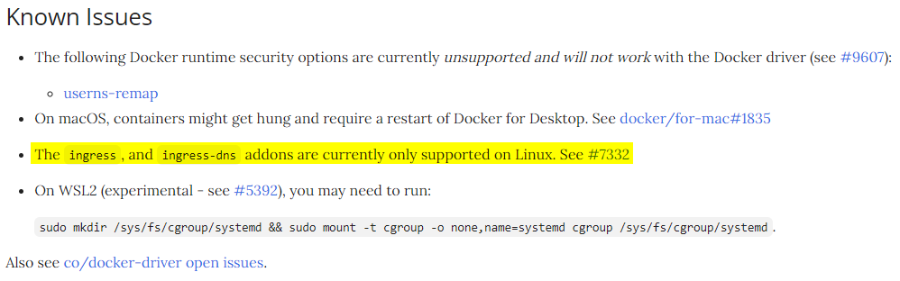
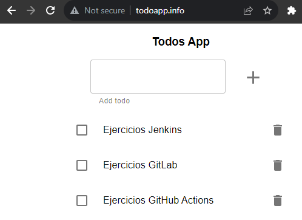
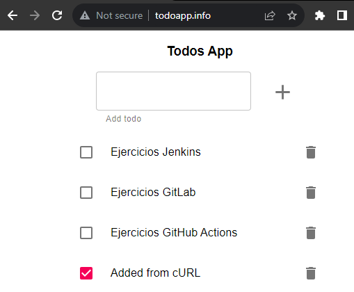
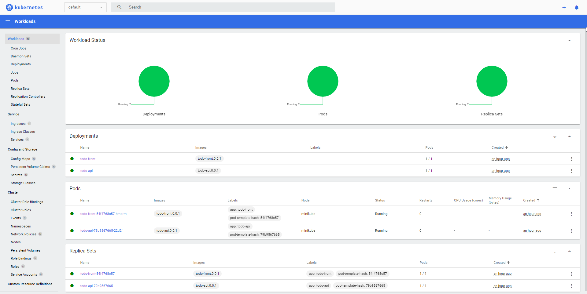
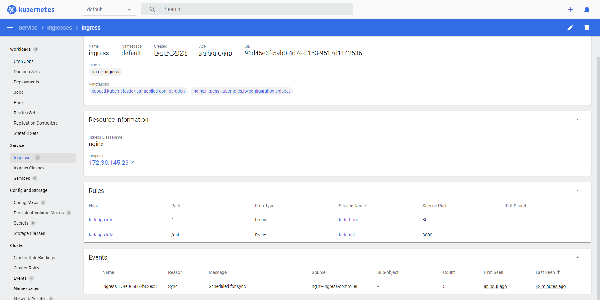

# Aplicación distribuida

El equipo de desarrollo de *Lemoncode* nos ha pedido disponibilizar dos aplicaciones, una UI expuesta a través de NGINX y una API que corre sobre Express/Node.js, ambas accesible desde un Ingress. Para este ejercicio, vamos a utilizar de nuevo *minikube* y algunos comandos de *Docker* para construir la imagen.


## ⚠️ Antes de comenzar... ⚠️

En primer lugar debemos revisar si minikube soporta Ingress para el driver y el sistema operativo donde queremos utilizarlo.

Según la documentación oficial, en el momento de la escritura de este ejercicio, Ingress no está soportado con el driver de Docker en Windows ([Docker Driver - Known issues](https://minikube.sigs.k8s.io/docs/drivers/docker/#known-issues)).



En este caso, voy a utilizar el driver de [Hyper-V](https://minikube.sigs.k8s.io/docs/drivers/hyperv/) y para ello hay que abrir una terminal de PowerShell como administrador y ejecutar el siguiente comando.

```
Enable-WindowsOptionalFeature -Online -FeatureName Microsoft-Hyper-V -All
```

Dependiendo si Hyper-V está habilitado habrá que reiniciar para aplicar los cambios o no.

## Inicialización y configuración del cluster

Lo primero que vamos a realizar es levantar el cluster de minikube indicándole que el driver a usar es el de Hyper-V (en caso de ejecutar en Linux, podemos utilizar el driver de Docker).

```shell
$ minikube start --driver=hyperv
😄  minikube v1.31.2 on Microsoft Windows 10 Pro 10.0.19045.3693 Build 19045.3693
✨  Using the hyperv driver based on existing profile

💣  Exiting due to PROVIDER_HYPERV_NOT_RUNNING: Hyper-V requires Administrator privileges
💡  Suggestion: Right-click the PowerShell icon and select Run as Administrator to open PowerShell in elevated mode.
```

Al ejecutar el comando en nuestra terminal de Git Bash dentro de VS Code, nos indica que necesitamos permisos elevados. Por sencillez, abrimos una terminal de PowerShell como administrador y ejecutamos el comando.

```
minikube start --driver=hyperv
```

A continuación, vamos a apuntar la terminal para usar el daemon de Docker dentro de minikube y así reusar las imágenes creadas localmente, como hemos hecho anteriormente con la salvedad que esta vez el comando es para PowerShell (en caso de usar Git Bash con permisos elevados, se puede usar directamente la función eval).

```
& minikube -p minikube docker-env --shell powershell | Invoke-Expression
```

Ejecutamos los siguientes comandos para generar localmente las dos imágenes necesarias.

```
docker build -f todo-api/Dockerfile -t todo-api:0.0.1 todo-api/
docker build -f todo-front/Dockerfile -t todo-front:0.0.1 todo-front/
```

Una vez creadas las imágenes y accesibles desde el cluster, habilitamos el addon de ingress.

```powershell
PS> minikube addons enable ingress
* ingress is an addon maintained by Kubernetes. For any concerns contact minikube on GitHub.
You can view the list of minikube maintainers at: https://github.com/kubernetes/minikube/blob/master/OWNERS
  - Using image registry.k8s.io/ingress-nginx/controller:v1.8.1
  - Using image registry.k8s.io/ingress-nginx/kube-webhook-certgen:v20230407
  - Using image registry.k8s.io/ingress-nginx/kube-webhook-certgen:v20230407
* Verifying ingress addon...
* The 'ingress' addon is enabled

PS> minikube addons enable ingress-dns
* ingress-dns is an addon maintained by minikube. For any concerns contact minikube on GitHub.
You can view the list of minikube maintainers at: https://github.com/kubernetes/minikube/blob/master/OWNERS
  - Using image gcr.io/k8s-minikube/minikube-ingress-dns:0.0.2
* The 'ingress-dns' addon is enabled
```

Podemos comprobar que el controlador de Ingress NGINX está corriendo de manera satisfactoria.

```shell
$ kubectl get pods -n ingress-nginx
NAME                                        READY   STATUS      RESTARTS   AGE
ingress-nginx-admission-create-jhzqg        0/1     Completed   0          81s
ingress-nginx-admission-patch-vmfnk         0/1     Completed   1          81s
ingress-nginx-controller-7799c6795f-p9mpb   1/1     Running     0          81s
```

Ya tenemos configurado el cluster para utilizar Ingress, por lo que podemos continuar creando todos los objetos de Kubernetes necesarios para la realización del ejercicio.

## Creación de los componentes de la API

### Config Map
```yaml
apiVersion: v1
kind: ConfigMap
metadata:
  name: todo-api
data:
  NODE_ENV: production
  PORT: "3000"
```

### Deployment
```yaml
apiVersion: apps/v1
kind: Deployment
metadata:
  name: todo-api
spec:
  selector:
    matchLabels:
      app: todo-api
  template:
    metadata:
      labels:
        app: todo-api
    spec:
      containers:
      - name: todo-api
        image: todo-api:0.0.1
        resources:
          limits:
            memory: "128Mi"
            cpu: "500m"
        ports:
        - containerPort: 3000
```

## Service
```yaml
apiVersion: v1
kind: Service
metadata:
  name: todo-api
spec:
  selector:
    app: todo-api
  ports:
  - port: 3000
    targetPort: 3000
  type: NodePort
```

## Creación de los componentes del Front

### Deployment
```yaml
apiVersion: apps/v1
kind: Deployment
metadata:
  name: todo-front
spec:
  selector:
    matchLabels:
      app: todo-front
  template:
    metadata:
      labels:
        app: todo-front
    spec:
      containers:
      - name: todo-front
        image: todo-front:0.0.1
        resources:
          limits:
            memory: "128Mi"
            cpu: "500m"
        ports:
        - containerPort: 80
```

### Service
```yaml
apiVersion: v1
kind: Service
metadata:
  name: todo-front
spec:
  selector:
    app: todo-front
  ports:
  - port: 80
    targetPort: 80
  type: NodePort
```

## Creación de los componentes del Ingress

```yaml
apiVersion: networking.k8s.io/v1
kind: Ingress
metadata:
  name: ingress
  labels:
    name: ingress
  annotations:
    nginx.ingress.kubernetes.io/configuration-snippet: |
      add_header Cache-Control "max-age=0, no-cache, no-store, must-revalidate";
spec:
  rules:
  - host: todoapp.info
    http:
      paths:
      - pathType: Prefix
        path: "/"
        backend:
          service:
            name: todo-front
            port: 
              number: 80
      - pathType: Prefix
        path: "/api/"
        backend:
          service:
            name: todo-api
            port: 
              number: 3000
```

❗ La anotación disponible en el objeto es solamente necesaria si al acceder al host [http://todoapp.info/](http://todoapp.info/) devuelve siempre un código HTTP 304 (Not modified resource).

## Comprobación del servicio

En primer lugar desplegamos todos los objetos.

```shell
$ kubectl apply -f k8s/.
configmap/todo-api created
deployment.apps/todo-api created
service/todo-api created
deployment.apps/todo-front created
service/todo-front created
ingress.networking.k8s.io/ingress created
```

Comprobamos que el servicio de Ingress se ha configurado correctamente y anotamos la dirección IP y el host.

```
$ kubectl get ingress
NAME      CLASS   HOSTS          ADDRESS         PORTS   AGE
ingress   nginx   todoapp.info   172.30.145.23   80      73s
```

Añadimos en nuestro fichero /etc/hosts la siguiente linea para que el navegador pueda resolver el host.

```
172.30.145.23 todoapp.info
```

Ahora accedemos a la URL [http://todoapp.info/](http://todoapp.info/) e insertamos algunos registros.



Si accedemos a la URL [http://todoapp.info/api/](http://todoapp.info/api/) desde el navegador o hacemos una llamada GET con cURL, obtenemos la respuesta de la API.

```shell
$ curl http://todoapp.info/api
[{"title":"Ejercicios Jenkins","completed":false,"id":1701805476470,"dueDate":"2023-12-05T19:44:36.235Z"},{"title":"Ejercicios GitLab","completed":false,"id":1701805495894,"dueDate":"2023-12-05T19:44:55.671Z"},{"title":"Ejercicios GitHub Actions","completed":false,"id":1701805511070,"dueDate":"2023-12-05T19:45:10.853Z"}]
```

Incluso podemos insertar datos haciendo un POST a la API.

```shell
$ curl 'http://todoapp.info/api/' \
>   -H 'Content-Type: application/json' \
>   --data-raw '{"title":"Added from cURL","completed":true,"dueDate":"2024-01-01T00:00:00.000Z"}'
ok
```

Si revisamos el front de nuevo, vemos la nueva entrada *Added from cURL*.



Por lo tanto, concluimos que el Ingress está funcionando de la manera esperada, permitiéndonos acceder a diferentes servicios a través del mismo hostname, pero cambiando solamente el path.

## Bonus - Kubernetes Dashboard

Podemos ver todos los componentes desplegados en Kubernetes a través del [Dashboard de Kuberntes](https://github.com/kubernetes/dashboard). Minikube tiene soporte para este y simplemente ejecutando el siguiente comando en la terminal nos abrirá el propio proceso el dashboard en nuestro navegador favorito.

```
minikube dashboard
```





Este dashboard nos permite consultar y observar de manera más visual e intuitiva la información de Kubernetes, sin tener que hacer uso de la terminal y el comando kubectl.

## Limpieza del cluster

Para limpiar todos los objetos creados en este ejercicio, simplemente hay que utilizar el comando *DELETE*.

```shell
$ kubectl delete -f k8s/.
```

A continuación, bajamos el cluster de minikube

```powershell
PS> minikube stop
```