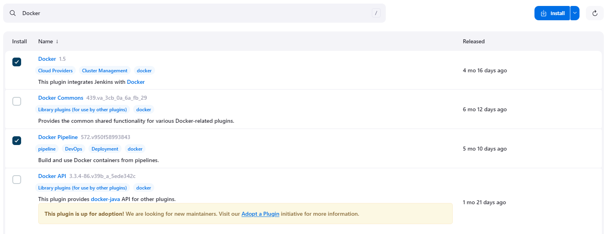

# Ejercicios Jenkins

## Ejercicio 1: CI/CD de una aplicación Java + Gradle

### Preparación del entorno de Jenkins

Construimos la imagen personalizada de Jenkins con Gradle con el siguiente comando.

```
docker build -f gradle.Dockerfile -t jenkins-gradle:0.0.1 .
```

Creamos una red y un volumen de datos para Jenkins.

```
docker network create jenkins
docker volume create jenkins_home
```

Ejecutamos nuestra imagen de Jenkins.

```
docker container run -d --name jenkins \
                        --network jenkins \
                        -p 8080:8080 \
                        -p 50000:50000 \
                        -v jenkins_home:/var/jenkins_home \
                        jenkins-gradle:0.0.1
```

Comprobamos que está en ejecución.

```shell
$ docker ps
CONTAINER ID   IMAGE                  COMMAND                  CREATED              STATUS              PORTS                                              NAMES
6be886f5a1ef   jenkins-gradle:0.0.1   "/usr/bin/tini -- /u…"   About a minute ago   Up About a minute   0.0.0.0:8080->8080/tcp, 0.0.0.0:50000->50000/tcp   jenkins
```

Y entramos a la URL [http://localhost:8080](http://localhost:8080). Una vez Jenkins haya terminado de arrancar, nos pedirá la contraseña inicial. Para ello, podemos mostrar el contenido del fichero indicado (también se puede ver en los logs ejecutando el comando *docker logs jenkins*). 

```shell
$ docker exec jenkins cat /var/jenkins_home/secrets/initialAdminPassword
cc26d172f22247e08c769a9c6a0bf26c
```

Una vez introducida la contraseña, procedemos con la instalación seleccionando la opción de *plugins sugeridos*. Más tarde nos pedirá si queremos crear un usuario administrador y la posibilidad de configurar la URL de Jenkins.

Al finalizar el proceso, ya tendremos nuestro Jenkins listo para comenzar a trabajar en él.

### Jugueteando con las pipelines

Vamos a crear nuestra primera pipeline. Para ello, nos situamos en el dashboard de Jenkins y hacemos click en *New Item*. Introducimos un nombre, seleccionamos el tipo *Pipeline* y aceptamos.

En la configuración, nos vamos a la definición de pipeline y seleccionamos *Pipeline script*.

Por último, introducimos el siguiente script y guardamos.

```groovy
pipeline {
    agent any
    stages {
        stage('Checkout') {
            steps {
                deleteDir()
                
                checkout scmGit(
                    branches: [[name: 'main']],
                    userRemoteConfigs: [[url: 'https://github.com/danielfajardo/bl-devops-exercises/']])
                
                dir('./03-ci-cd/01-jenkins/calculator') {
                    sh 'chmod +x gradlew'
                }
            }
        }
        stage('Compile') {
            steps {
                dir('./03-ci-cd/01-jenkins/calculator') {
                    echo "Compiling source code!"
                    sh './gradlew compileJava'
                    
                }
            }
        }
        stage('Unit Tests') {
            steps {
                dir('./03-ci-cd/01-jenkins/calculator') {
                    echo "Launching tests!"
                    sh './gradlew test'
                }
            }
        }
        stage('Failed Unit Tests') {
            steps {
                dir('./03-ci-cd/01-jenkins/calculator') {
                    echo "Hacking the tests just to fail!"
                    sh 'sed -i "s/5/55/g" src/test/java/com/lemoncode/calculator/CalculatorTest.java'
                    
                    echo "Launching tests!"
                    sh './gradlew test'
                }
            }
        }
    }
}
```

El script consta de 4 stages:
- *Checkout*:
    1. Limpia el directorio para tener una build completamente limpia.
    2. Descarga el repositorio remoto.
    3. Asigna permisos de ejecución al fichero gradlew.
- *Compile*: Realiza la compilación del proyecto.
- *Unit Tests*: Ejecuta los test unitarios del proyecto.
- *Failed Unit Tests*: 
    1. Cambia el código fuente de los test unitarios para que fallen.
    2. Ejecuta los tests unitarios.

Una vez creada la pipeline, le damos a *Build Now* y observamos como los 3 primeros stages han resultado satisfactorios, pero el último ha fallado, como espererábamos.


Si hacemos click en el step fallido, podemos ver qué es lo que ha fallado. En este caso se puede observar que ha fallado el test *testSum*.


Ya tenemos configurada nuestra primera pipeline, pero... ¿cómo podemos tener dicha pipeline con control de versiones? Aquí entra en juego el fichero *Jenkinsfile*.

## Jenkinsfile

Guardamos nuestro script (ya no hace falta guardar la prueba de *Failed Unit Tests*) en un fichero llamado *Jenkinsfile* y lo subimos a nuestro repositorio de Github.

A continuación, volvemos a crear un nuevo proyecto de tipo *Pipeline* (también podría ser interesante utilizar un proyecto de tipo *Multibranch Pipeline* en caso de querer construir en diferentes ramas) y en la definición de pipeline, seleccionamos *Pipeline script from SCM*.

En la configuración de SCM, seleccionamos Git como proveedor, añadimos la URL del repositorio y la rama a construir. 


Por último, le indicamos la ruta donde se encuentra el fichero Jenkinsfile.


Ya tenemos configurada nuestra pipeline, solamente queda darle a *Build Now*.


En este caso, vemos que hay 4 stages, pero solamente hemos configurado 3 en el pipeline. Esto es debido a que el stage *Declarative: Checkout SCM* es necesario para encontrar el fichero Jenkinsfile. Una vez descargado el repositorio, ya ejecuta la pipeline tal y como tenemos definida.

Para este caso en concreto, nos podríamos ahorrar el checkout de nuestra pipeline, pero para casos en los que el repo que se descarga es diferente de dónde está alojado el fichero *Jenkinsfile* puede ser interesante esta configuración.

## Ejercicio 2: Modificar la pipeline para que utilice la imagen Docker de Gradle como build agent

En primer lugar tenemos que eliminar el contenedor anterior de Jenkins.

```
docker rm -f jenkins
```
A continuación, vamos a generar una imagen custom de Jenkins que contenga el cliente de Docker. Por ejemplo, podemos crear este Dockerfile.

```dockerfile
FROM jenkins/jenkins:lts

USER root

# install docker-cli
RUN apt-get update && apt-get install -y lsb-release
RUN curl -fsSLo /usr/share/keyrings/docker-archive-keyring.asc \
  https://download.docker.com/linux/debian/gpg
RUN echo "deb [arch=$(dpkg --print-architecture) \
  signed-by=/usr/share/keyrings/docker-archive-keyring.asc] \
  https://download.docker.com/linux/debian \
  $(lsb_release -cs) stable" > /etc/apt/sources.list.d/docker.list
RUN apt-get update && apt-get install -y docker-ce-cli
```

Construimos la imagen.

```
docker build -f Dockerfile -t jenkins:0.0.1 .
```

Por último, levantamos un contenedor con la imagen de Docker in Docker y a la imagen de Jenkins le indicamos dónde está el host de Docker principalmente.

```
docker container run -d --name jenkins-docker \
                        --network jenkins \
                        --network-alias docker \
                        --privileged \
                        -p 2376:2376 \
                        -v jenkins_home:/var/jenkins_home \
                        -v jenkins-docker-certs:/certs/client \
                        -e DOCKER_TLS_CERTDIR=/certs \
                        docker:dind

docker container run -d --name jenkins \
                        --network jenkins \
                        -p 8080:8080 \
                        -p 50000:50000 \
                        -v jenkins_home:/var/jenkins_home \
                        -v jenkins-docker-certs:/certs/client:ro \
                        -e DOCKER_HOST=tcp://docker:2376 \
                        -e DOCKER_CERT_PATH=/certs/client \
                        -e DOCKER_TLS_VERIFY=1 \
                        jenkins:0.0.1
```

Tendremos que tener los siguientes contenedores corriendo.

```shell
$ docker ps
CONTAINER ID   IMAGE           COMMAND                  CREATED         STATUS         PORTS                                              NAMES
c29389e188db   docker:dind     "dockerd-entrypoint.…"   5 minutes ago   Up 5 minutes   2375/tcp, 0.0.0.0:2376->2376/tcp                   jenkins-docker
30ac4218144c   jenkins:0.0.1   "/usr/bin/tini -- /u…"   6 minutes ago   Up 6 minutes   0.0.0.0:8080->8080/tcp, 0.0.0.0:50000->50000/tcp   jenkins
```

Al entrar en Jenkins, observaremos que todo sigue configurado tal y como teníamos anteriormente debido a la persistencia de datos.

Ahora necesitamos instalar los plugins *Docker* y *Docker Pipeline*. Para ello desde el panel principal, realizamos la siguiente navegación.

> Manage Jenkins &rarr; Plugins (System Configuration) &rarr; Available Plugins

Buscamos ambos plugins y los instalamos.



A continuación nos indica el progreso de la descarga, en el que podemos indicarle que reinicie Jenkins cuando la instalación esté completa.


Al finalizar el proceso, si vamos a la pestaña de *Installed Plugins* veremos que los tenemos ya habilitados, por lo que podemos continuar con el ejercicio.


Ahora podemos configurar nuestra pipeline, siguiendo los pasos del ejercicio anterior con la salvedad que nuestro Jenkinsfile en vez de tener declarado que puede correr en cualquier agente, tendrá declarado la siguiente imagen de Docker.

```dockerfile
agent {
        docker {
            image 'gradle:7.3-jdk17'
        }
    }
```

Ejecutamos una nueva build y vemos que todo sigue funcionando correctamente.


Y si observamos el log, vemos que la build se ha ejecutado dentro de un contenedor.

