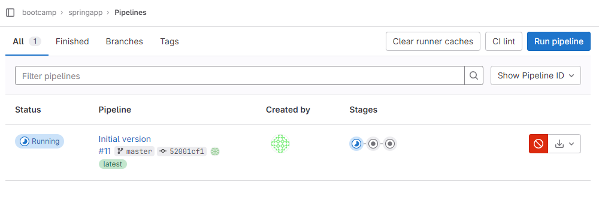

# Ejercicios GitLab

### Preparación del entorno

Los ejercicios se realizan en un entorno local de GitLab. Para ello, hay que seguir los pasos indicados en el repositorio del bootcamp de Lemoncode: [GitLab - Creación del entorno](https://github.com/Lemoncode/bootcamp-devops-lemoncode/blob/master/03-cd/02-gitlab/README.md#creaci%C3%B3n-del-entorno).

Una vez levantado el entorno, podemos acceder a GitLab a través de la siguiente URL: [http://gitlab.local:8888/](http://gitlab.local:8888/).

A continuación, creamos un usuario de tipo *regular* y un grupo, al que tiene que pertenecer el anterior usuario creado, que utilizaremos como base para crear nuestros proyectos.

## Ejercicio 1 - CI/CD de una aplicación Spring

Creamos un nuevo proyecto en blanco en GitLab, llamado *springapp* dentro del grupo creado anteriormente.


Preparamos nuestro código fuente en nuestro repositorio local y añadimos en la raíz un fichero con nombre *.gitlab-ci.yml* que contendrá la definición de nuestra pipeline.

La primera parte es la encargada de definir los stages disponibles en la pipeline.

Nos indican que creemos cuatro stages:
 - maven:package
 - maven:verify
 - docker:build
 - deploy

No obstante, teniendo en cuenta el [funcionamiento de Maven](https://maven.apache.org/guides/introduction/introduction-to-the-lifecycle.html#a-build-lifecycle-is-made-up-of-phases), nos podemos ahorrar la fase de package, ya que verify la va a ejecutar previamente. Por lo tanto, nuestros stages finalmente serán los siguientes 3.

```yaml
stages:
  - maven:verify
  - docker:build
  - deploy
```
A continuación se define cada uno de los stages. 

En primer lugar creamos el job de *maven:verify*, donde le indicamos:
 1. La imagen de Docker a utilizar para las fases de compilación, construcción y ejecución de pruebas. 
 2. El nombre del stage.
 3. Las tareas a realizar en el job.
 4. Se define qué ficheros se van a guardar como artefactos, en este caso solo los ficheros con extension *jar*.

```yaml
maven_verify_job:
  image: maven:3.8.8-eclipse-temurin-8
  stage: maven:verify
  script:
    - mvn clean verify
  artifacts:
    when: on_success
    paths:
      - "target/*.jar"
```

En segundo lugar, el job de *docker:build*, indicándole además del nombre y las tareas a realizar, su dependencia con el job de *maven:verify* a través del keyword [needs](https://docs.gitlab.com/ee/ci/yaml/#needsartifacts), pues necesita el artefacto para generar la imagen de Docker.

```yaml
docker_build_job:
  stage: docker:build
  needs:
    - maven_verify_job
  script:
    - docker build -t $CI_REGISTRY/$CI_PROJECT_PATH:$CI_COMMIT_SHA . 
```

En último lugar, el job de *deploy* realizará el despliegue en local. Para ello en primer lugar tiene que comprobar si el contenedor con nombre *springapp* está en ejecución y si lo está, lo elimina con el fin de asegurar que siempre se despliega la última versión. Por último, se ejecuta la aplicación.

```yaml
deploy_job:
  stage: deploy
  needs:
    - docker_build_job
  before_script:
    - if [[ "$(docker ps --filter "name=springapp" --format '{{.Names}}')" == "springapp" ]]; then  docker rm -f springapp;  fi
  script:
    - docker run --name "springapp" -d -p 8080:8080 $CI_REGISTRY/$CI_PROJECT_PATH:$CI_COMMIT_SHA
```

Finalmente, subimos todos los ficheros a nuestro repositorio remoto.


A continuación, nos vamos a la sección de *pipelines* de nuestro proyecto y vemos que está en ejecución.



Una vez que la build haya terminado los 3 stages, debemos ver algo similar a lo siguiente.


Comprobamos entonces que el despliegue se ha realizado correctamente. Para ello accedemos a la URL [http://localhost:8080/](http://localhost:8080/).


Por lo tanto, tenemos desplegado correctamente nuestro servicio.

Antes de seguir con el siguiente ejercicio, vamos a bichear un poco la pipeline.


Aquí podemos observar las dependencias entre cada una de las pipelines que coincide exactamente con lo que tenemos definido en nuestro fichero *.gitlab-ci.yml*.

Si hacemos click en *Jobs*, podemos re-ejecutar alguno de los stages en caso de ser necesario.


Al ejecutar en cada uno de los jobs, podemos ver los logs, donde observamos que el stage de *maven:verify* ha subido un único artefacto y que *docker:build* se lo ha descargado.


Por último, vamos a hacer un redespliegue del contenedor para comprobar que elimina el contenedor anterior y crea uno nuevo.


El job se ha ejecutado de manera satisfactoria, por lo tanto si observamos los contenedores en ejecución utilizando el comando *docker ps* en el host, veremos que se ha creado recientemente.

```shell
$ docker ps --filter "name=springapp"
CONTAINER ID   IMAGE                                                                           COMMAND                  CREATED         STATUS         PORTS                    NAMES    
740cca2d4e95   gitlab.local:5001/bootcamp/springapp:52001cf17d49a0fdc90126ccb0914eacad2cd899   "/bin/sh -c 'exec ja…"   2 minutes ago   Up 2 minutes   0.0.0.0:8080->8080/tcp   springapp
```