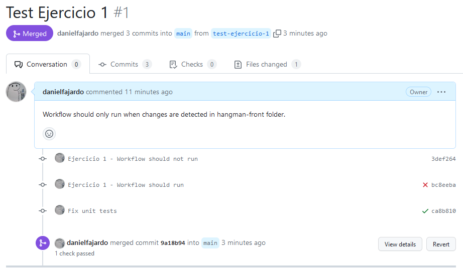
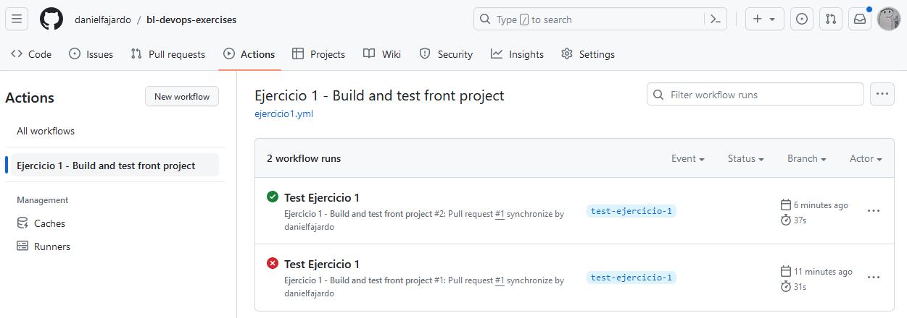
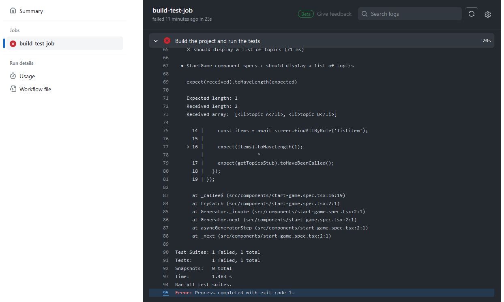
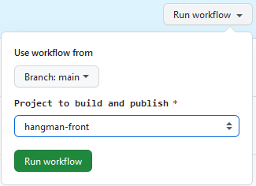
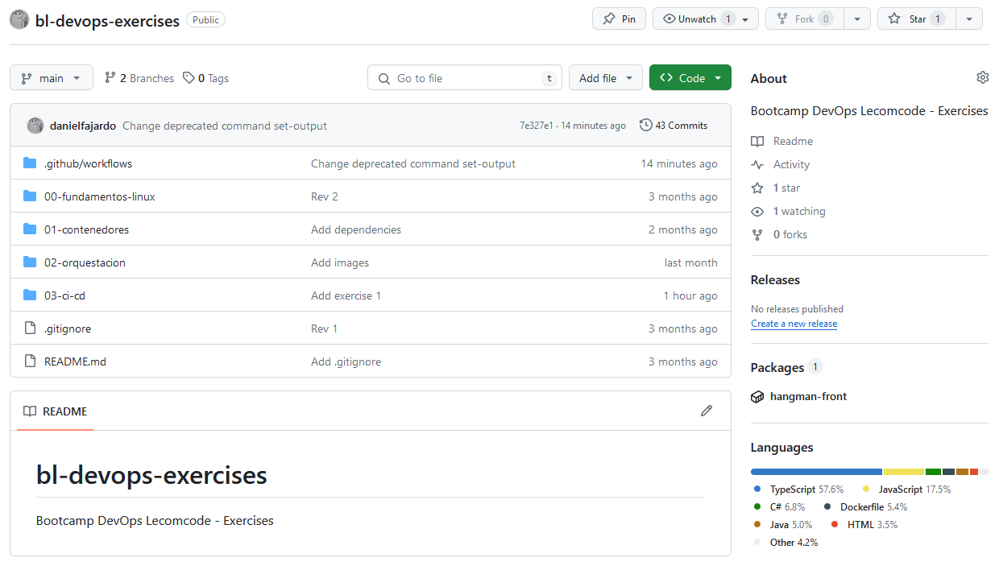
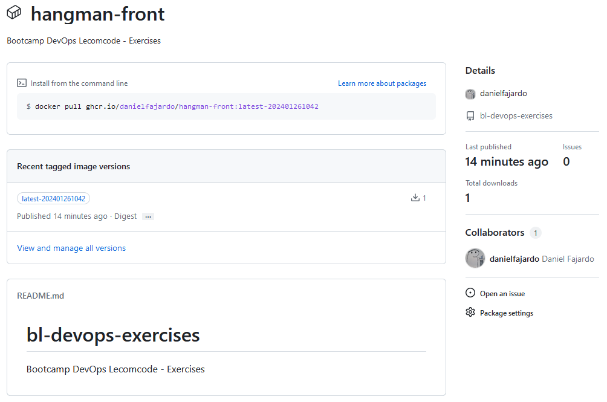
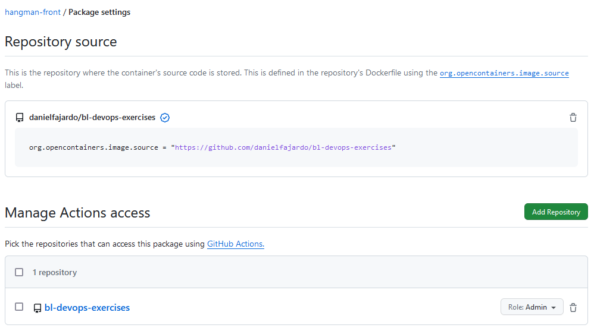

# Ejercicios GitHub Actions

## Ejercicio 1 - Crea un workflow CI para el proyecto de frontend

En este ejercicio vamos a crear un workflow de CI para el proyecto de frontend. Este workflow, que construirá el proyecto y ejecutará los test unitarios, se debe ejecutar cuando haya cambios en el proyecto *hangman-front* y exista una pull request.

Para ello necesitamos crear nuestros workflows bajo la ruta *.github/workflows*. Dentro de esta carpeta, creamos el fichero *ejercicio1.yml* con el siguiente contenido:

```yaml
name: Ejercicio 1 - Build and test front project

on:
  pull_request:
    paths: 
    - '03-ci-cd/03-github-actions/hangman-front/**'

jobs:
  build-test-job:
    runs-on: ubuntu-latest
    steps:
      - uses: actions/checkout@v4
      - name: Build the project and run the tests
        working-directory: ./03-ci-cd/03-github-actions/hangman-front
        run: |
          npm ci
          npm run build
          npm test
```

Para comprobar el workflow realizamos el siguiente proceso:
 1. Creamos una rama *test-ejercicio-1* y creamos el fichero *README.md* en el proyecto *hangman-api*.
 2. Hacemos push y creamos una *Pull Request (PR)*.
 3. Comprobamos que el workflow no se ha ejecutado.
 4. Creamos el fichero *README.md* en el proyecto *hangman-api* en la misma rama y hacemos push.
 5. El workflow si se ha ejecutado esta vez y ha fallado porque el test unitario tiene un error. Lo arreglamos y volvemos a hacer push.
 6. Comprobamos que termina satisfactoriamente y hacemos merge a la rama principal.



También podemos comprobar las ejecuciones en la pestaña *Actions*.



Y dentro de estas podemos ver los logs de cada step.



## Ejercicio 2 - Crea un workflow CD para el proyecto de frontend

En este ejercicio vamos a crear un nuevo workflow que se dispare manualmente con el objetivo de crear una imagen de Docker y que esta se publique en el [container registry de GitHub](https://docs.github.com/en/packages/working-with-a-github-packages-registry/working-with-the-container-registry).

Para ello vamos a crear un fichero *ejercicio2.yml* donde vamos a ir insertando los siguientes fragmentos.

```yaml
name: Ejercicio 2 - Build and Publish an image into GH Container Registry

on:
  workflow_dispatch:
    inputs:
      project:
        description: 'Project to build and publish'
        type: choice
        required: true
        default: 'hangman-front'
        options:
          - 'hangman-front'
          - 'hangman-api'

env:
  REGISTRY: ghcr.io
```
Indicamos que el workflow se va a ejecutar manualmente con el evento *workflow_dispatch*. Además configuramos una entrada del usuario que contendrá las opciones de proyectos a construir. 


Por último, creamos una variable de entorno que contiene el dominio del container registry de GitHub.

```yaml
jobs:
  docker-publish-job:
    runs-on: ubuntu-latest
    
    permissions:
      contents: read
      packages: write
```

Otorgamos permisos de lectura para los contenidos y de escritura para poder publicar nuestro paquete.

```yaml
    steps:
      - uses: actions/checkout@v4

      - name: Get current date
        id: current_date
        run: echo "::set-output name=date::$(date +'%Y%m%d%H%M')"
      
      - name: Login to GitHub Container Registry
        uses: docker/login-action@v3
        with:
          registry: ${{ env.REGISTRY }}
          username: ${{ github.repository_owner }}
          password: ${{ secrets.GITHUB_TOKEN }}
      
      - name: Extract metadata for Docker
        id: meta
        uses: docker/metadata-action@v5
        with:
          images: ${{ env.REGISTRY }}/${{ github.repository_owner }}/${{ inputs.project }}
          tags: type=raw,value=latest-${{ steps.current_date.outputs.date }},enable=${{ github.ref == format('refs/heads/{0}', 'main') }}
      
      - name: Build the image and push to Github container registry
        uses: docker/build-push-action@v5
        with:
          context: ./03-ci-cd/03-github-actions/${{ inputs.project }}
          push: true
          tags: ${{ steps.meta.outputs.tags }}
          labels: ${{ steps.meta.outputs.labels }}
```
El workflow contiene 5 pasos:
 1. Checkout del repositorio.
 2. Devolver la fecha actual en formato YYYYmmddHHMM.
 3. Hacer login a GitHub Container Registry
 4. Extraer metadatos para la imagen de Docker. Uno de ellos es el tag de versión, donde le indicamos que si se construye desde la rama *main*, la versión sea *latest-YYYYmmddHHMM* donde la fecha es tomada del paso 2.
 5. Construcción de la imagen junto con los metadatos generados en el paso anterior y publicación en el registro.

Para probar el workflow, nos vamos a la pestaña Actions, seleccionamos el workflow *Ejercicio 2 - Build and Publish an image into GH Container Registry*, hacemos click en Run Workflow, elegimos *hangman-front* y le damos a Run workflow.

Una vez finalizado el workflow, nuestro paquete estará disponible para ser usado y aparecerá en la UI de GitHub de nuestro proyecto.



Si accedemos al paquete, vemos que se ha generado una versión con el formato de fecha indicado anteriormente.



⚠️ Si se ejecuta el workflow desde un repositorio privado para hacer pruebas, el paquete se creará como privado. Si luego queremos ejecutar sobre otro repositorio distinto, tendremos que configurar los permisos en el *Package Settings*.



